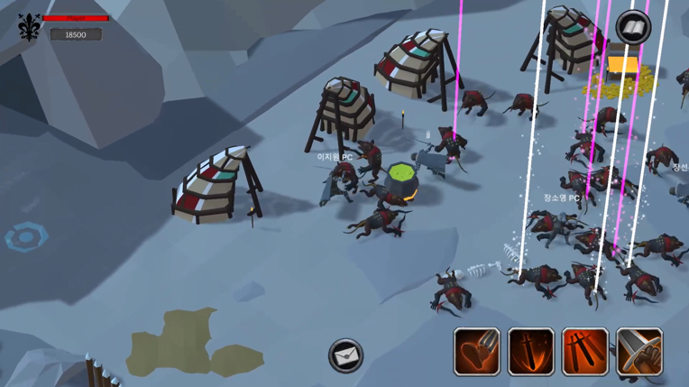
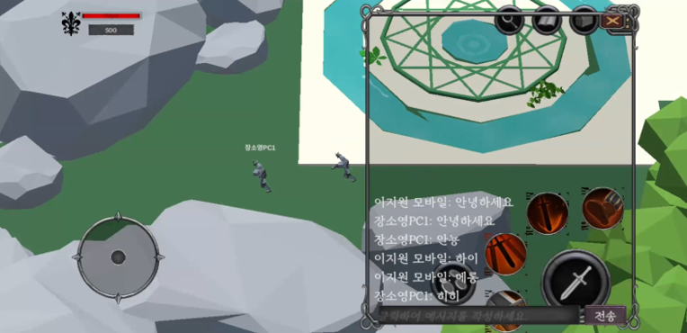

# Mercenary Story

**Unity 3D 팀 프로젝트**

[](https://youtu.be/EKmOzcoP82k)

---

## 📷 인게임 스크린샷

<div style="display: flex; justify-content: center; gap: 40px;">

  <div style="text-align: center;">
    <p><strong>PC 버전 인게임 스크린샷</strong></p>
    
  </div>

  <div style="text-align: center;">
    <p><strong>안드로이드 버전 인게임 스크린샷</strong></p>
    
  </div>

</div>

---

## 📌 프로젝트 개요

- **프로젝트 명**: Mercenary Story
- **목표**: 판타지 던전 RPG 게임 개발 (모바일/PC 크로스 플랫폼)
- **개발 기간**: 2025.01.06 ~ 2025.01.28 (23일)
- **개발 환경**: Unity 3D (C#)
- **개발 인원**: 총 8인
  - 개발 4인
  - 기획 4인

---

## 🎯 주요 기능

- **멀티플레이**: Photon을 활용한 실시간 멀티플레이 지원
- **파티 시스템**: 친구 초대, 파티 생성 및 탈퇴 기능
- **채팅 시스템**: 실시간 채팅 및 로그 시스템
- **DB 연동**: Firebase 기반 로그인 및 유저 데이터 관리
- **던전 시스템**: 파티 기반 던전 입장 및 전투
- **퀘스트/아이템/장비 시스템**: 퀘스트 진행 및 보상 획득, 장비 강화

---

## 🛠 사용 기술

- Unity 2022.3.50f1
- C#
- Photon Engine (PUN2) (멀티플레이 서버 구현)
- Firebase Authentication (email 계정 정보 저장)
- Firebase Realtime Database (유저, 파티 정보 서버 저장)

---

## 📁 프로젝트 구조 (일부)

```

MercenaryStory/
├── Assets/
│ ├── 00_Scenes/
│ ├── 01_Scripts/
│ ├── 02_Textures/
│ ├── 03_Fonts/
│ ├── 04_Prefabs/
│ ├── 05_Animations/
│ ├── 06_Models/
│ ├── 07_Shaders/
│ ├── 08_Mesh/
│ ├── 09_ScriptableObject/
│ ├── 10_Sounds/
│ ├── Firebase/
│ ├── Photon/
│ └── Resources/
├── Packages/
├── ProjectSettings/
└── README.md

```

---

## 💬 참고 사항

- **PC와 안드로이드 간의 크로스 플랫폼 멀티플레이** 지원  
  → 서로 다른 플랫폼에서도 같은 파티로 던전에 입장하고, 실시간 채팅 및 협력 플레이 가능
- 하나의 서버에서 다양한 디바이스가 동시에 접속할 수 있도록 **Photon 서버 기반 구조 설계**
- 실제 테스트에서도 PC ↔ Android 간 **입장, 채팅, 파티, 전투 전 과정 문제없이 연동**
- Firebase를 활용한 계정 연동 및 데이터 저장으로 플랫폼 간 유저 정보 공유 가능

---

## 🙌 팀원 정보

### 👨‍💻 개발팀

- **이지원 (팀장)**

  - 멀티플레이 전반
  - 파티 시스템
  - 채팅 시스템
  - Firebase 기반 DB 연동

- **장선우**

  - 몬스터 행동 패턴 구현
  - 사운드 매니저 구현
  - 옵션 시스템 구현

- **김승용**

  - 플레이어 조작(PC/안드로이드) 시스템 구현
  - 플레이어 전투 시스템 구현

- **장소영**

  - 인벤토리, 상점 시스템 구현
  - 아이템 드랍, 획득 시스템 구현

---

### 📝 기획팀

- **최건웅 (팀장, PD, PM)**

  - 몬스터, 로비 컨셉 기획
  - 멀티 시스템 기획
  - 인벤토리, 상점, 옵션 시스템 기획

- **오명석**

  - 게임 내 캐릭터 조작 및 전투 시스템 기획
  - UI 제작

- **정민혁**

  - 레벨 디자인 및 제작
  - 보스 몬스터 컨셉 기획

- **김용주**
  - 채팅 시스템 기획
  - 게임 전체 데이터 테이블 작성 및 관리

---

> 본 프로젝트는 짧은 개발 기간 안에 **크로스 플랫폼 기반의 멀티플레이 RPG**를 구현하는 데 중점을 둔 실습형 팀 프로젝트입니다.
